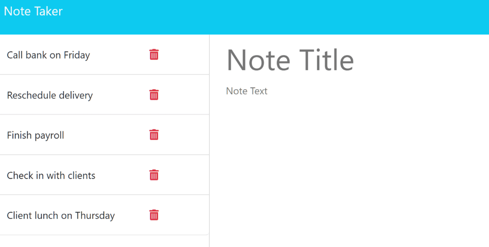

# Note Taker

## Description
This program allows you to write and save notes. You can view previous written notes, and delete those that are no longer applicable. To view on Heroku pages, click <a href="https://sheltered-atoll-13770.herokuapp.com/notes">here</a>.

## Installation
This program uses Express v4.16.4 and uuid v8.3.2. To install, copoy and pase the following into your command line:

```sh
npm install
```

To run the program, use the following command:

```sh
node server.js
```
## Visuals

